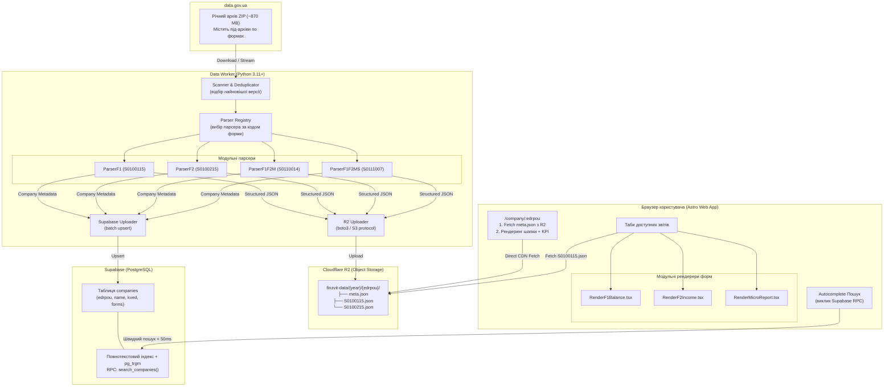

# Архітектура FinZvit

Документ описує технічну архітектуру та дизайн системи **FinZvit**: від обробки вхідних архівів XML до рендерингу фінансових звітів у браузері користувача.

---

## 1. Загальна діаграма системи



---

## 2. Data Pipeline: Модульні парсери (Python Worker)

### 2.1. Архітектура та інтерфейс базового парсера
Усі форми фінансової звітності парсяться через спільний базовий клас `BaseFormParser`:

```python
from abc import ABC, abstractmethod
from typing import Dict, Any, Optional

class BaseFormParser(ABC):
    """Базовий клас для модульних парсерів фінансових звітів."""

    @property
    @abstractmethod
    def form_code(self) -> str:
        """Код форми (наприклад, 'S0100115')."""
        pass

    @property
    @abstractmethod
    def form_name(self) -> str:
        """Офіційна назва форми (наприклад, 'Ф1. Баланс')."""
        pass

    @abstractmethod
    def parse(self, xml_bytes: bytes) -> Dict[str, Any]:
        """
        Парсить байти XML та повертає структурований словник звіту:
        {
            "meta": {...},
            "company": {...},
            "data": { "рядок": {"begin": X, "end": Y} }
        }
        """
        pass
```

### 2.2. Розподіл парсерів за формами

1. **`ParserF1` (`S0100115`)**:
   - Форма № 1 «Баланс (Звіт про фінансовий стан)».
   - Мапінг колонок:
     - Тег `A{код}` → `begin` (На початок звітного періоду).
     - Тег `B{код}` → `end` (На кінець звітного періоду).
   - Одиниця виміру: тис. грн.

2. **`ParserF2` (`S0100215`)**:
   - Форма № 2 «Звіт про фінансові результати (Звіт про сукупний дохід)».
   - Мапінг колонок:
     - Тег `A{код}` → `current` (За звітний період).
     - Тег `B{код}` → `previous` (За аналогічний період минулого року).

3. **`ParserF1F2M` (`S0110014`)**:
   - Форми 1-м та 2-м (Малі підприємства).
   - Баланс:
     - `A{код}_3` → `begin` (На початок року).
     - `A{код}_4` → `end` (На кінець звітного періоду).
   - Звіт про фінрезультати:
     - `B{код}_3` → `current` (За звітний період).
     - `B{код}_4` → `previous` (За попередній період).
   - Розбивається на 2 окремі логічні звіти: Баланс та Фінрезультати.

4. **`ParserF1F2Ms` (`S0111007`)**:
   - Форми 1-мс та 2-мс (Мікропідприємства).
   - Аналогічний розподіл суфіксів `_3` та `_4`.

### 2.3. Алгоритм дедуплікації версій
Вхідний архів містить файли з форматом імені:
`{EDRPOU}_{REG}{RAJ}{TIN}{FORM_CODE}{DOC_CNT}{MONTH}{YEAR}.XML_{TIMESTAMP}.xml`

Приклад: `32673400_460140032673400S010011510000006122025.XML_2026-06-05 16:47:46.xml`

**Кроки алгоритму**:
1. Сканер витягує з назви:
   - `edrpou` (перші 8 цифр перед першим `_`)
   - `form_code` (підстрока виду `S01.....`)
   - `timestamp` (дата і час після `.XML_`)
2. Застосовується групування в пам'яті:
   `key = (edrpou, form_code)`
3. Для кожного ключа зберігається тільки запис із максимальним `timestamp`.
4. Лише відібрані XML-файли передаються на парсинг.

---

## 3. Сховище даних (Cloudflare R2)

Кожен звіт зберігається у вигляді окремого чистого статичного JSON-файлу:

```text
finzvit-data/
└── 2025/
    ├── 32673400/
    │   ├── meta.json          # Метаінформація, реквізити, перелік поданих форм
    │   ├── S0100115.json      # Ф1. Баланс
    │   ├── S0100215.json      # Ф2. Фінрезультати
    │   └── S0100311.json      # Ф3. Рух коштів (опціонально)
    └── 00290771/
        ├── meta.json
        ├── S0100115.json
        └── S0100215.json
```

### Формат файлу `meta.json`:
```json
{
  "edrpou": "32673400",
  "name": "ТзОВ \"Кормотех\"",
  "kved": "10.92",
  "kved_name": "Виробництво готових кормів для домашніх тварин",
  "address": "81062  с.Прилбичі, Яворівський р-н., Львівська обл.",
  "territory": "ЛЬВІВСЬКА ОБЛАСТЬ, ЯВОРІВСЬКИЙ РАЙОН, С. ПРИЛБИЧІ",
  "opf_code": "240",
  "opf_name": "Товариство з обмеженою відповідальністю",
  "employees": 999,
  "accounting_standard": "МСФЗ",
  "available_forms": [
    {
      "code": "S0100115",
      "title": "Баланс (Ф1)",
      "date_filled": "2026-06-05"
    },
    {
      "code": "S0100215",
      "title": "Фінрезультати (Ф2)",
      "date_filled": "2026-06-05"
    }
  ],
  "last_updated": "2026-06-05 16:47:46"
}
```

### Формат файлу форми (`S0100115.json`):
```json
{
  "meta": {
    "edrpou": "32673400",
    "form_code": "S0100115",
    "period_year": 2025,
    "date_filled": "2026-06-05"
  },
  "data": {
    "1000": { "begin": 1192, "end": 1307 },
    "1001": { "begin": 3734, "end": 4371 },
    "1002": { "begin": 2542, "end": 3064 },
    "1005": { "begin": 13775, "end": 68772 },
    "1010": { "begin": 619068, "end": 579146 }
  }
}
```

---

## 4. База даних Supabase (Реєстр та Пошук)

### Схема таблиці `companies`:
```sql
CREATE TABLE public.companies (
    edrpou VARCHAR(10) PRIMARY KEY,
    name TEXT NOT NULL,
    kved VARCHAR(10),
    kved_name TEXT,
    address TEXT,
    territory TEXT,
    opf_name TEXT,
    employees INTEGER,
    accounting_standard TEXT,
    available_forms JSONB DEFAULT '[]'::jsonb,
    year SMALLINT DEFAULT 2025,
    updated_at TIMESTAMP WITH TIME ZONE DEFAULT NOW()
);
```

### Оптимізація пошуку:
- Створюється триграмний індекс (`gin_trgm_ops`) по полю `name` та btree індекс по полю `edrpou`.
- Створюється RPC-функція `search_companies(query text, lim int)`:
  - Якщо `query` складається з цифр — використовується прямий префіксний пошук `WHERE edrpou LIKE query || '%'`.
  - Якщо `query` текст — виконується пошук за схожістю назви або повнотекстовий пошук (FTS) з обмеженням `LIMIT lim`.
  - Відповідь повертає легкий JSON (до 10 записів) вагою < 2 КБ.

---

## 5. Веб-інтерфейс (Astro + React)

### 5.1. Розділені компоненти рендерингу (React Islands)

Кожна форма має окремий рендерер, що інкапсулює:
1. Шаблон структури бланку (рядки, ієрархія, підсумки).
2. Специфіку колонок (Початок/Кінець vs Звітний/Попередній).
3. Специфічні правила розрахунку змін.

Компоненти:
- `ReportContainer.tsx`: контейнер табів, перемикання між доступними формами, ліниве завантаження JSON із R2.
- `RenderF1Balance.tsx`: рендерер балансу (розділи I, II, III активу, I, II, III, IV, V пасиву; згортання/розгортання секцій).
- `RenderF2Income.tsx`: рендерер звіту про фінансові результати (розділи I, II, III, IV).
- `RenderMicroReport.tsx`: рендерер для скорочених форм малого та мікропідприємництва.

### 5.2. Визначення структури форм (`form-definitions.ts`)
Структура офіційних бланків зберігається у типізованих константах TypeScript:
```typescript
export interface StatementRow {
  code: string | null;      // Код рядка (1000, 1010 тощо) або null для заголовків
  name: string;             // Назва статті
  level: number;            // 0 - заголовок розділу, 1 - стаття, 2 - підстаття
  isTotal?: boolean;        // Чи рядок є підсумковим
  isDeduction?: boolean;    // Чи значення віднімається (знос, амортизація)
  section?: string;         // "АКТИВ" / "ПАСИВ"
}
```

---

## 6. Безпека та масштабування

1. **Безпека**:
   - Доступ до Supabase з фронтенду здійснюється виключно через публічний анонімний ключ (`anon_key`) з увімкненим Row Level Security (RLS) у режимі тільки читання (`SELECT`).
   - R2 бакет публічний лише для читання (`GET`, `HEAD`), операції запису виконуються тільки воркером за допомогою IAM ключів.
2. **Масштабування**:
   - Статичний сайт на Cloudflare Pages кешується на edge-вузлах по всьому світу.
   - Cloudflare R2 витримує мільйони паралельних запитів на читання без додаткових витрат.
