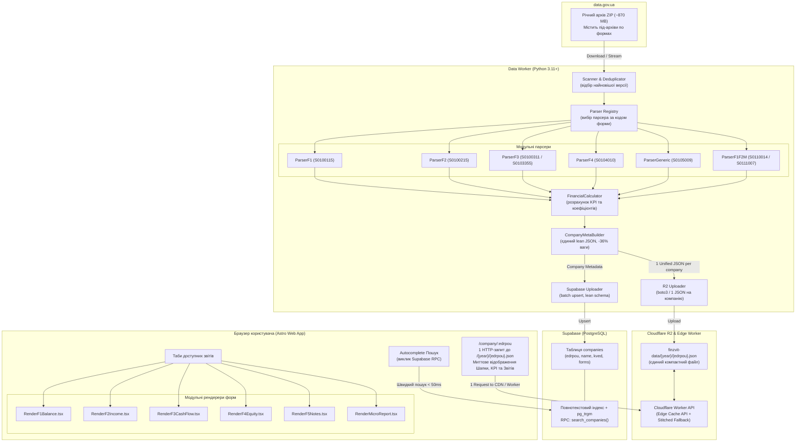

# Архітектура FinZvit

Документ описує технічну архітектуру та дизайн системи **FinZvit**: від обробки вхідних архівів XML до рендерингу фінансових звітів у браузері користувача.

---

## 1. Загальна діаграма системи



---

## 2. Data Pipeline: Модульні парсери (Python Worker)

### 2.1. Архітектура та інтерфейс базового парсера
Усі форми фінансової звітності парсяться через спільний базовий клас `BaseFormParser`:

```python
from abc import ABC, abstractmethod
from typing import Dict, Any, Optional

class BaseFormParser(ABC):
    """Базовий клас для модульних парсерів фінансових звітів."""

    @property
    @abstractmethod
    def form_code(self) -> str:
        """Код форми (наприклад, 'S0100115')."""
        pass

    @property
    @abstractmethod
    def form_name(self) -> str:
        """Офіційна назва форми (наприклад, 'Ф1. Баланс')."""
        pass

    @abstractmethod
    def parse(self, xml_bytes: bytes) -> Dict[str, Any]:
        """
        Парсить байти XML та повертає структурований словник звіту:
        {
            "meta": {...},
            "company": {...},
            "data": { "рядок": {"begin": X, "end": Y} }
        }
        """
        pass
```

### 2.2. Розподіл парсерів за формами

1. **`ParserF1` (`S0100115`)**:
   - Форма № 1 «Баланс (Звіт про фінансовий стан)».
   - Мапінг колонок:
     - Тег `A{код}` → `begin` (На початок звітного періоду).
     - Тег `B{код}` → `end` (На кінець звітного періоду).
   - Одиниця виміру: тис. грн.

2. **`ParserF2` (`S0100215`)**:
   - Форма № 2 «Звіт про фінансові результати (Звіт про сукупний дохід)».
   - Мапінг колонок:
     - Тег `A{код}` → `current` (За звітний період).
     - Тег `B{код}` → `previous` (За аналогічний період минулого року).

3. **`ParserF3` (`S0100311` та `S0103355`)**:
   - Форма № 3 «Звіт про рух грошових коштів»:
     - **Прямий метод (`S0100311`)**: тег `A{код}` → `receipts` (надходження), `B{код}` → `payments` (видаток).
     - **Непрямий метод (`S0103355`)**: тег `A{код}` → `receipts` (надходження / приплив), `B{код}` → `payments` (видаток / відтік).

4. **`ParserF4` (`S0104010`)**:
   - Форма № 4 «Звіт про власний капітал».
   - Багатовимірний аналіз капіталу:
     - `col_3` (зареєстрований / пайовий капітал), `col_4` (капітал у дооцінках),
     - `col_5` (додатковий капітал), `col_6` (резервний капітал),
     - `col_7` (нераподілений прибуток / непокритий збиток),
     - `col_8` (неоплачений капітал), `col_9` (вилучений капітал),
     - `col_10` (разом власний капітал).

5. **`ParserGeneric` (`S0105009` та інші форми)**:
   - Форма № 5 «Примітки до річної фінансової звітності».
   - Забезпечує універсальний безпечний видобуток числових показників для багатосекційних звітів (розділи I–XV).

6. **`ParserF1F2M` (`S0110014`)**:
   - Форми 1-м та 2-м (Малі підприємства).
   - Баланс: `A{код}_3` → `begin`, `A{код}_4` → `end`.
   - Звіт про фінрезультати: `B{код}_3` → `current`, `B{код}_4` → `previous`.

7. **`ParserF1F2Ms` (`S0111007`)**:
   - Форми 1-мс та 2-мс (Мікропідприємства).

### 2.3. Алгоритм дедуплікації версій
Вхідний архів містить файли з форматом імені:
`{EDRPOU}_{REG}{RAJ}{TIN}{FORM_CODE}{DOC_CNT}{MONTH}{YEAR}.XML_{TIMESTAMP}.xml`

Приклад: `32673400_460140032673400S010011510000006122025.XML_2026-06-05 16:47:46.xml`

**Кроки алгоритму**:
1. Сканер витягує з назви:
   - `edrpou` (перші 8 цифр перед першим `_`)
   - `form_code` (підстрока виду `S01.....`)
   - `timestamp` (дата і час після `.XML_`)
2. Застосовується групування в пам'яті:
   `key = (edrpou, form_code)`
3. Для кожного ключа зберігається тільки запис із максимальним `timestamp`.
4. Лише відібрані XML-файли передаються на парсинг.

### 2.4. Попередній розрахунок KPI (`FinancialCalculator`)
Для забезпечення миттєвого рендерингу в браузері та відсутності складних обчислень на клієнті, модуль `worker/financial_calc.py` на етапі обробки розраховує:
- **Базові показники**:
  - Чистий дохід від реалізації (рядок 2000 Ф2)
  - Чистий прибуток або збиток (рядок 2350/2355 Ф2)
  - Валовий прибуток / збиток (рядок 2090/2095 Ф2)
  - Операційний прибуток (EBIT, рядок 2190/2195 Ф2)
  - EBITDA (EBIT + амортизація рядок 2515 Ф2 / Примітки)
  - Активи компанії (рядок 1300 Ф1)
  - Власний капітал (рядок 1495 Ф1)
- **Фінансові коефіцієнти та маржинальність**:
  - `net_margin_pct` (чиста маржа, %)
  - `gross_margin_pct` (валова маржа, %)
  - `operating_margin_pct` (операційна маржа, %)
  - `roa_pct` (рентабельність активів, Return on Assets, %)
  - `roe_pct` (рентабельність власного капіталу, Return on Equity, %)
  - `current_ratio` (коефіцієнт поточної ліквідності: оборотні активи 1195 / поточні зобов'язання 1695)
  - `debt_to_equity` (коефіцієнт фінансового левериджу: зобов'язання 1595+1695 / капітал 1495)
- **Динаміку**: абсолютну зміну (`change`) та відсоток зростання (`change_pct`) до аналогічного періоду минулого року.

### 2.5. Побудова ультра-оптимізованого JSON (`CompanyMetaBuilder`)
Задля економії операцій запису у сховище R2 та прискорення завантаження веб-сторінок:
1. **Єдиний файл на підприємство**: замість 4–6 окремих файлів (`meta.json`, `S0100115.json`, `S0100215.json` тощо) створюється єдиний документ `/{year}/{edrpou}.json`.
2. **Нульове дублювання реквізитів**: видалено 5-кратне дублювання блоку `company` з кожної вкладеної форми.
3. **Видалення мета-заголовків**: назви звітів централізовано зберігаються в масиві `available_forms`.
4. **Очищення порожніх полів (`_clean_report_data`)**: рекурсивне видалення всіх `None`/`null` полів та порожніх рядків таблиць (особливо актуально для форми Ф4, де 9 колонок).
5. **Результат**: скорочення розміру JSON-файлу на **~36%** без найменшої втрати даних.

---

## 3. Сховище даних (Cloudflare R2 & Edge Worker)

### 3.1. Уніфікована структура єдиного Lean JSON
Усі звіти компанії за конкретний рік зберігаються у **єдиному статичному JSON-файлі**:

```text
finzvit-data/
└── 2025/
    ├── 32673400.json          # ТзОВ "Кормотех" (всі реквізити, KPI та 5 форм)
    ├── 31316718.json          # ТОВ "Нова Пошта" (всі реквізити, KPI та 5 форм)
    └── 00290771.json          # ПрАТ "Укргідроенерго"
```

### 3.2. Формат файлу `/{year}/{edrpou}.json`:
```json
{
  "company": {
    "edrpou": "32673400",
    "name": "ТзОВ \"Кормотех\"",
    "kved": "10.92",
    "kved_name": "Виробництво готових кормів для домашніх тварин",
    "address": "81062  с.Прилбичі, Яворівський р-н., Львівська обл.",
    "territory": "ЛЬВІВСЬКА ОБЛАСТЬ, ЯВОРІВСЬКИЙ РАЙОН, С. ПРИЛБИЧІ",
    "opf_code": "240",
    "opf_name": "Товариство з обмеженою відповідальністю",
    "employees": 999,
    "accounting_standard": "МСФЗ"
  },
  "financial_kpi": {
    "revenue": { "current": 4627763.0, "previous": 3615486.0, "change": 1012277.0, "change_pct": 28.0 },
    "net_profit": { "current": 476834.0, "previous": 362486.0, "change": 114348.0, "change_pct": 31.54 },
    "assets": { "current": 3416734.0, "previous": 2697843.0, "change": 718891.0, "change_pct": 26.65 },
    "equity": { "current": 1789432.0, "previous": 1312598.0, "change": 476834.0, "change_pct": 36.33 },
    "ebitda": { "current": 648210.0, "previous": 501340.0, "change": 146870.0, "change_pct": 29.3 },
    "net_margin_pct": 10.3,
    "gross_margin_pct": 24.1,
    "operating_margin_pct": 11.2,
    "current_ratio": 1.84,
    "debt_to_equity": 0.91,
    "roa_pct": 13.96,
    "roe_pct": 26.65
  },
  "available_forms": [
    { "code": "S0100115", "title": "Баланс (Ф1)", "date_filled": "2026-06-05" },
    { "code": "S0100215", "title": "Фінрезультати (Ф2)", "date_filled": "2026-06-05" },
    { "code": "S0100311", "title": "Рух коштів (Ф3)", "date_filled": "2026-06-05" },
    { "code": "S0104010", "title": "Власний капітал (Ф4)", "date_filled": "2026-06-05" },
    { "code": "S0105009", "title": "Примітки (Ф5)", "date_filled": "2026-06-05" }
  ],
  "reports": {
    "S0100115": {
      "1000": { "begin": 1192, "end": 1307 },
      "1001": { "begin": 3734, "end": 4371 },
      "1300": { "begin": 2697843, "end": 3416734 },
      "1495": { "begin": 1312598, "end": 1789432 },
      "1900": { "begin": 2697843, "end": 3416734 }
    },
    "S0100215": {
      "2000": { "current": 4627763, "previous": 3615486 },
      "2350": { "current": 476834, "previous": 362486 }
    }
  },
  "last_updated": "2026-06-05 16:47:46"
}
```

### 3.3. Економіка сховища та ліміти Cloudflare R2
- **Зменшення Class A (write) операцій на 80%**: Замість 5–6 окремих файлів на компанію (~2.5 млн операцій запису на річний масив України, що перевищувало ліміт Free Tier 1 млн/міс), тепер здійснюється рівно 1 операція запису на компанію (~435 тис. операцій), повністю вкладаючись у безкоштовний тариф.
- **Зменшення мережевих витрат (Zero Egress)**: Відсутня плата за вихідний трафік у Cloudflare R2.
- **Cloudflare Edge Worker API (`web/src/worker.ts`)**:
  - Пряме швидкісне обслуговування єдиних консолідованих файлів `/{year}/{edrpou}.json` та реєстру підприємств.
  - HTTP-заголовки `Cache-Control: public, max-age=86400, s-maxage=604800, stale-while-revalidate=86400`.

---

## 4. База даних Supabase (Ультра-легкий реєстр та Пошук)

### 4.1. Схема оптимізованої таблиці `companies`:
```sql
CREATE TABLE public.companies (
    edrpou VARCHAR(10) PRIMARY KEY,
    name TEXT NOT NULL,
    kved VARCHAR(10),
    kved_name TEXT,
    available_forms JSONB DEFAULT '[]'::jsonb,
    year SMALLINT DEFAULT 2025,
    updated_at TIMESTAMP WITH TIME ZONE DEFAULT NOW()
);
```

### 4.2. Економія пам'яті та оптимізація запитів:
- **Зменшення розміру БД на 50%**: Усі важкі текстові реквізити (юридична адреса, територія, ОПФ, стандарти обліку) виносяться в R2 JSON, залишаючи в PostgreSQL лише дані, необхідні для швидкого пошуку. Це дозволяє зберігати понад 450,000 підприємств без ризику виходу за 500 MB дискового ліміту Supabase Free Tier.
- **Індексація пошуку**:
  - Триграмний GIN індекс (`gin_trgm_ops`) по полю `name` для нечіткого пошуку за назвою компанії.
  - B-tree індекс по первинному ключу `edrpou` для миттєвого пошуку за кодом.
- **RPC функція `search_companies(query text, lim int)`**:
  - Цифровий запит → швидкий пошук за префіксом `edrpou LIKE query || '%'`.
  - Текстовий запит → ранжований триграмний пошук за назвою з `LIMIT lim`.

---

## 5. Веб-інтерфейс (Astro + React)

### 5.1. Розділені компоненти рендерингу (React Islands)

Кожна форма має окремий модульний рендерер:
- `ReportContainer.tsx`: контейнер табів, керування активною формою, адаптація під мобільні екрани.
- `RenderF1Balance.tsx`: Баланс (Ф1) — розділи I–III активу, I–V пасиву, інтерактивне згортання розділів, перевірка балансової рівності.
- `RenderF2Income.tsx`: Звіт про фінрезультати (Ф2) — доходи, витрати, сукупний дохід, елементи операційних витрат.
- `RenderF3CashFlow.tsx`: Звіт про рух грошових коштів (Ф3) — підтримка як прямого (`S0100311`), так і непрямого (`S0103355`) методу.
- `RenderF4Equity.tsx`: Звіт про власний капітал (Ф4) — повнорозмірна 10-колонкова матриця змін у власному капіталі з горизонтальним скролом та підсвічуванням рядків.
- `RenderF5Notes.tsx`: Примітки до річної звітності (Ф5) — багатосекційні таблиці нематеріальних активів, основних засобів, запасів, зобов'язань тощо.
- `RenderMicroReport.tsx`: Спрощені форми для малого та мікробізнесу (Ф1-м/Ф2-м та Ф1-мс/Ф2-мс).
- `RenderGenericReport.tsx`: Універсальний рендерер для додаткових спеціалізованих форм звітності.

### 5.2. Робота клієнтського API
Клієнт завантажує дані компанії за **1 єдиний HTTP-запит**:
```typescript
const data = await fetchCompanyData(edrpou, year);
// data.company -> реквізити для шапки
// data.financial_kpi -> готові показники для карток KPI
// data.reports -> дані всіх форм для табів без повторних запитів
```

---

## 6. Безпека та масштабування

1. **Безпека**:
   - Supabase захищено Row Level Security (RLS) у режимі тільки читання (`SELECT`) через публічний ключ (`anon_key`).
   - Бакет Cloudflare R2 захищений від прямих мутацій; оновлення відбуваються виключно через підписані запити воркера з авторизацією AWS S3 V4.
2. **Масштабування**:
   - Статичний сайт на Cloudflare Pages кешується на edge-вузлах по всьому світу.
   - Cloudflare R2 витримує мільйони паралельних запитів на читання без додаткових витрат.

---

## 7. Тестування та контроль якості (Test Suite)

Проєкт містить автоматизований набір з **54 unit-тестів** (`tests/`), що покривають усі ключові компоненти системи:

1. **Парсинг усіх 5 форм звітності (`test_xml_to_json_parser.py`)**:
   - Тестування форм Ф1, Ф2, Ф3 (прямий та непрямий методи), Ф4 та Ф5 на реальних XML-файлах підприємств різного масштабу (ТзОВ «Кормотех» 32673400 та ТОВ «Нова Пошта» 31316718).
2. **Перевірка фундаментальних бухгалтерських рівностей**:
   - Баланс: `Рядок 1300 (Усього активів) == Рядок 1900 (Усього пасивів)`.
   - Власний капітал: `Рядок 4295 графа 10 (Ф4) == Рядок 1495 графа 4 (Баланс Ф1)`.
   - Грошові кошти: `Рядок 3415 графа 3/4 (Ф3) == Рядок 1165 графа 3/4 (Баланс Ф1)`.
3. **Розрахунок фінансових KPI (`test_financial_calc.py`)**:
   - Верифікація обчислення виручки, чистого прибутку, EBITDA, чистої/валової маржі, ROA, ROE, Current Ratio та Debt-to-Equity.
4. **Стійкість до крайових випадків XML (`test_xml_parsing_edge_cases.py`)**:
   - Обробка кодування Windows-1251 без заголовка `encoding`.
   - Підтримка UTF-8 із Byte Order Mark (`\xef\xbb\xbf`).
   - Автоматичне очищення від null-байтів (`\x00`).
   - Обробка тегів з `xsi:nil="true"`.
   - Чітке розмежування дійсного нуля (`"0"`) та відсутності даних (`None`).
   - Числа з комами, пробілами та нерозривними пробілами (`\xa0`, `\u202f`).
   - Спеціальні XML-символи у назвах компаній (лапки, амперсанди, апострофи).
5. **Еталонне порівняння з CSV (`test_csv_comparison.py`)**:
   - Порядкове звірення розпарсених значень із `sample/comparison_financial_rows.csv`.
   - Звірення розрахованих KPI показників із `sample/comparison_financial_kpi.csv`.

**Запуск тестів**:
```bash
python3 -m unittest discover -v tests
```
